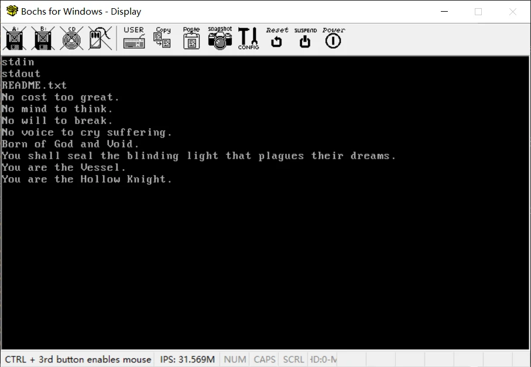
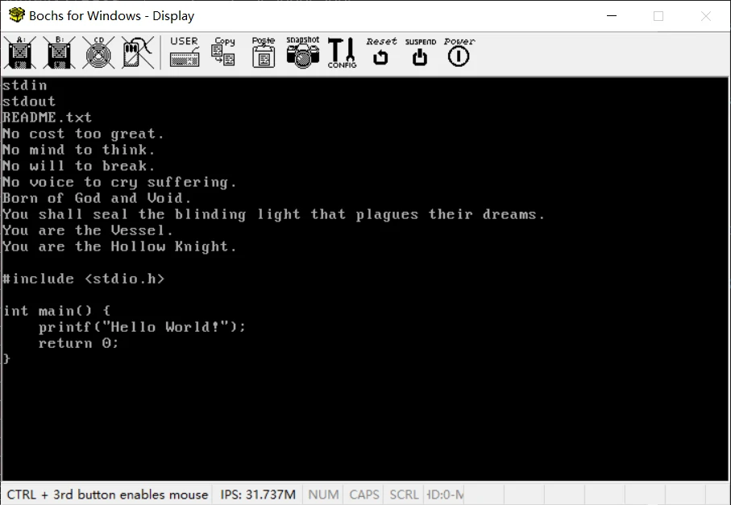

# MiniOS

MiniOS 是一个基于 x86 的简易操作系统内核，我之前写过一个 [MCOS](https://github.com/ADD-SP/MCOS)，不过不是很满意，所以又搞了这个项目。不同的地方是 MiniOS 更多地使用 C 语言编写，只在必要地方使用汇编，而且结构设计上相对合理。比如引入的内存池、文件映射和信号量等概念。

## 功能

内核依然十分简陋，但是实现了一个内核应该具有的基本的功能，以后大概会配一个 shell。

### 处理器管理

* 进程管理：创建、暂停、阻塞、恢复和结束进程。
* 线程管理：创建、暂停、阻塞、恢复和结束线程。
* 并发执行：线程为最小调度单位，按照先来先服务原则轮流执行。

### 内存管理

* 请求分页存储管理：每个进程都有 4GB 的虚拟地址空间。当访问的页面不存在时会自动安装页面或从硬盘中调入页面。
* 内存隔离：内核空间和用户空间隔离，用户空间无法任意访问内核空间。

### 外设管理

* 显示器：即 stdin 和 stdout。
* 键盘：识别字母、数字、多数符号、shift，ctrl 和 Caps Lock。

### 文件管理

* 常规功能：打开、关闭、读取、写入和删除文件。
* 文件映射：可以将文件中指定的内容映射到内存中，当读取这段内存时自动将文件内容从硬盘调入内存，用来处理大文件。关闭文件时自动写回硬盘。

## 说明文档

[点击进入（未完成）](docs/README.md)

## 如何使用

### 环境准备

* 操作系统：Windows + Linux
* 软件：nasm、gcc 和 bochs

### 编译内核和测试程序

运行下列命令会在 `bin` 目录下生成相关的程序，然后会生成一个虚拟硬盘映像并将对应的程序写入。

```bash
make all
```

* `mbr.bin`：主引导扇区程序
* `loader.bin`：内核加载程序
* `kernel.bin`：内核主程序
* `fstest.bin`：测试用用户程序
* `empty.bin`：请忽略此文件

### 配置 Bochs

1. 运行 Bochs 安装目录下的 `bochsdbg.exe`。
2. 在 `Edit Options ` 列中找到 `Disk & Boot` 项并双击。
3. 选择打开的窗口中的 `Boot Opitons` 选项卡，然后将 `Boot Driver #1` 设置为 `disk`。
4. 选择 `ATA chanel 0` 选项卡，选择 `First HD/CD on chanel 0` 子选项卡，将 `Path or pyhsical device name` 修改为虚拟硬盘的路径，`Type of disk image` 修改为 `flat`，并将 `Cylinder`、`Heads` 和 `Sector per track` 分别·修改为 203、16 和 63。你
5. 关闭当前的窗口，在 `Edit Options ` 列中找到 `Memory` 项并双击。
6. 选择 `Standard opitons` 选项卡，将 `Memory size [megabytes]` 设置为 1024，将 `Host alloced memory size [megabytes]` 设置为 2048。
7. 点击 `Save`。

### 启动 Bochs

运行 Bochs 安装目录下的 `bochsdbg.exe`，确保当前设置为上文说明的设置，然后点击 `Start` 开始模拟。

首先会显示现有的文件列表，提供三个—— stdout、stdin 和 README.txt。

然后会显示出一段文本（出自某游戏）：

> No cost too great.<br>No mind to think.<br>No will to break.<br>No voice to cry suffering.<br>Born of God and Void.<br>You shall seal the blinding light that plagues their dreams.<br>You are the Vessel.<br>You are the Hollow Knight.



最后可以通过键盘输入信息，并在界面上显示，但不会有任何效果，因为没有设计 shell。下图中就输入了一段经典的程序代码。




